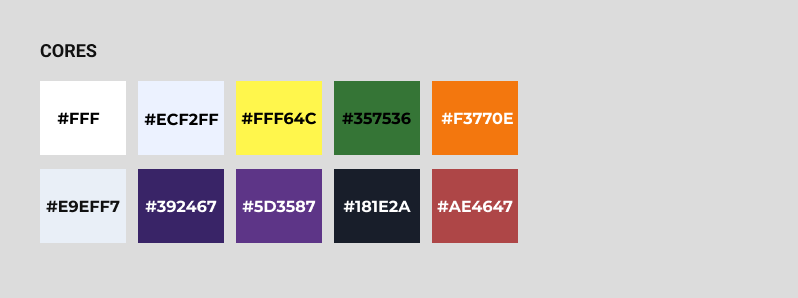
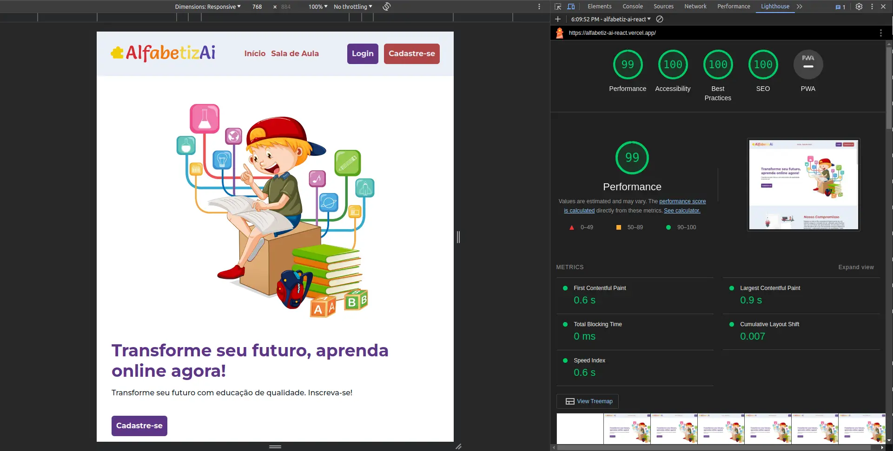

<div align="center">
<p>
  
</p>

[Clique aqui para visualizar o site](https://alfabetiz-ai-react.vercel.app/)

<br>

</div>
  
***

## Índice

- [1. Prefácio](#1-prefácio)
- [2. Orientações para a Tarefa](#2-orientações-para-a-tarefa)
- [3. Metodologia](#3-metodologia)
- [4. Detalhamento](#4-detalhamento)
- [5. Instruções para acessar o projeto](#5-instruções-para-acessar-o-projeto)
- [6. Tecnologias utilizadas](#6-tecnologias-utilizadas)
- [7. Performance e Melhoria da Landing Page](#7-performance-e-melhoria-da-landing-page)
- [8. Relatório de Requisitos do Backend para o Frontend](#8-relatório-de-requisitos-do-backend-para-o-frontend)
- [9. Desenvolvedores](#9-desenvolvedores)

---

## 1. Prefácio

Terceira atividade desenvolvida para o programa de estágio Vem Ser da empresa DBC Company - turma 13, que tem como objetivo desenvolver as nossas habilidades com o _React_ e _Typescript_ integrando o conhecimento adquirido em aula.

---

## 2. Orientações para a Tarefa

Criar um website de alfabetização digital para contribuir com os Objetivos do Desenvolvimento Sustentável.

### Requisitos da tarefa:

- [x] Criar uma _Landing Page_ responsiva;
- [x] Estabelecer as _Rotas_;
- [x] Criar tela de _cadastro_ e _login_;
- [x] Verificar no _Ligthouse_
  - Contrastes;
  - Legibilidade;
  - Acessibilidade;
- [x] _Deploy_ no _Vercel_
- [x] Documentação README.md estruturada e organizada
      Contribuição dos membros e uso correto do GIT-FLOW

---

## 3. Metodologia

- Realizamos reuniões pelo _Discord_ para definir o fluxo de trabalho (_git flow_ e dividir as tarefas).
- Utilizamos o _Trello_ para a organização das tarefas;
- Trabalhamos no mesmo repositório _codando_ em _branchs_ com nomes semânticos, sendo permitido somente abrir _pull request_ para a _branch develop_, após a tarefa conluída foi aberta a _pull request_ para a _branch main_;
- Para o código foi adotado criação de classes e _commites_ em inglês;
- Utilizamos o _Axios_ para realizar a comunicação com as _APIs_;
- Para simular as _APIs_ de Usuários fizemos o uso do _JSON server_;
- Todos os formulários possuem validações;
- Verificamos os níveis de acessibilidade e SEO pela ferramenta _Lighthouse_;

---

## 4. Detalhamento

### Paleta de Cores



---

## 5. Instruções para acessar o projeto

Este projeto tem como requisito o _deploy_ pelo _Vercel_, portando pode ser visualizado [clicando aqui](https://alfabetiz-ai-react.vercel.app/)

1 - Clone o projeto

```bash
git clone git@github.com:andr3felipe/alfabetizAi-react.git
```

2 - Instale as depêndencias

```bash
npm i
```

3 - Inicie o banco de dados (mockado)

```bash
npm run watch
```

4 - Inicie o projeto

```bash
npm run dev
```

---

## 6. Tecnologias utilizadas

<div>
<br>


</div>

 <br>

---

## 7. Performance e Melhoria da Landing Page

### 7.1 Otimizações Realizadas

- **Converção de Imagem:** Uma das imagens foi convertida para webp para otimizar a peformance.

- **Aspect Ratio:** Foi necessário utilizar o aspect ratio nos estilos da imagem para manter a proporção original.

### 7.2 Resultados no Lighthouse



---

## 8. Relatório de Requisitos do Backend para o Frontend

#### 8.1 Rota de Cadastro:

- **Descrição:** Permitir que novos usuários se cadastrem na aplicação.
- **Requisitos Funcionais:**
  - Endpoint para processar solicitações de cadastro.

#### 8.2 Rota de Login:

- **Descrição:** Permitir que usuários existentes façam login na aplicação.
- **Requisitos Funcionais:**
  - Endpoint para processar solicitações de login.
  - Geração de token de autenticação para usuários válidos.

#### 8.3 CRUD Admin:

- **Descrição:** Gerenciamento de administradores da aplicação.
- **Requisitos Funcionais:**
  - Endpoint para criar um novo administrador.
  - Endpoint para recuperar a lista de administradores.
  - Endpoint para atualizar informações de um administrador.
  - Endpoint para excluir um administrador.

#### 8.4 CRUD Usuário:

- **Descrição:** Gerenciamento de usuários.
- **Requisitos Funcionais:**
  - Endpoint para criar um novo usuário.
  - Endpoint para recuperar a lista de usuários.
  - Endpoint para atualizar informações de um usuário.
  - Endpoint para excluir um usuário.

#### 8.5 CRUD Alunos (Perfis):

- **Descrição:** Gerenciamento de perfis de alunos.
- **Requisitos Funcionais:**
  - Endpoint para criar um novo perfil de aluno.
  - Endpoint para recuperar a lista de perfis de alunos.
  - Endpoint para atualizar informações de um perfil de aluno.
  - Endpoint para excluir um perfil de aluno.

#### 8.6 CRUD Professor:

- **Descrição:** Gerenciamento de professores.
- **Requisitos Funcionais:**
  - Endpoint para criar um novo perfil de professor.
  - Endpoint para recuperar a lista de perfis de professores.
  - Endpoint para atualizar informações de um perfil de professor.
  - Endpoint para excluir um perfil de professor.

#### 8.7 CRUD Módulo:

- **Descrição:** Gerenciamento de módulos de ensino.
- **Requisitos Funcionais:**
  - Endpoint para criar um novo módulo.
  - Endpoint para recuperar a lista de módulos.
  - Endpoint para atualizar informações de um módulo.
  - Endpoint para excluir um módulo.

#### 8.8 CRUD Desafio:

- **Descrição:** Gerenciamento de desafios associados aos módulos.
- **Requisitos Funcionais:**
  - Endpoint para criar um novo desafio.
  - Endpoint para recuperar a lista de desafios.
  - Endpoint para atualizar informações de um desafio.
  - Endpoint para excluir um desafio.

### 9. Desenvolvedores

#### Davis Sampaio <br>

[Github](https://github.com/davislamenha)

#### André Felipe Souza <br>

[Github](https://github.com/andr3felipe)
<br>

---
